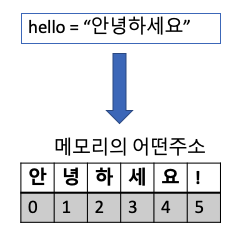

## 스트링은 왜 문자열 일까?

일반적인 string 의 뜻은 끈이나 줄을 뜻한다. 그런데 프로그래밍의 세계에서는 문자 여러개가 한번에 묶여져 있는 문자열을 스트링이라고 부르게 된다. 물론 문자열이 스트링이구나 하고 받아들여도 된다. 하지만 왜 string 이라는 이름을 붙였을지 생각해보는 것도 재미있으니 같이 보도록 하자.

파이썬에 문자를 특정 변수에 할당하게 되면, 메모리의 어딘가에 해당 값이 저장되게 되는데, 그 생김새가 아래와 같다.



그림과 같이 한글자씩 연달아서 메모리에 저장되게 되는데, 그 모양이 끈처럼 생겼기때문에 스트링이라는 이름을 붙인것이다. 스트링은 사실 charactor string 을 스트링으로 단축해서 부르는 것으로 이해하면 된다.

메모리에 할당된 주소가 궁금한 사람은 id(변수) 를 해보면 메모리의 주소가 나오게 된다.

```
str = "안녕하세요"
print(id(str))

# 16진수로 보고 싶은경우 hex를 사용하면 된다.

print(hex(id(str)))
```
